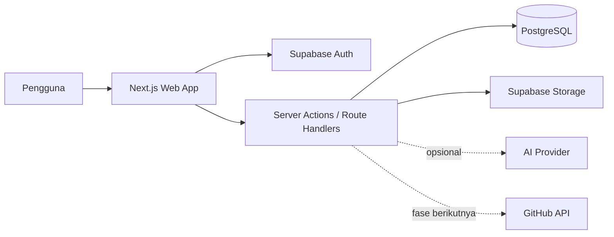
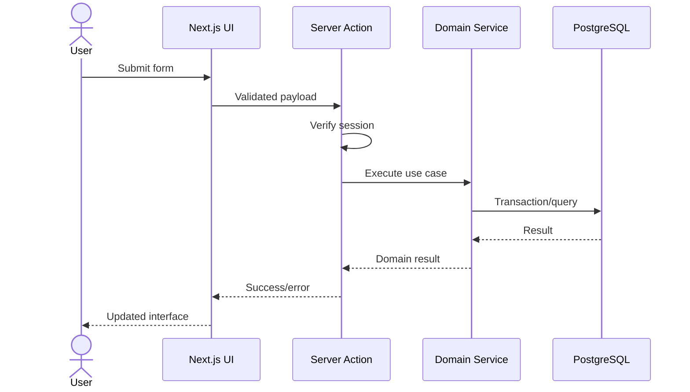

# Architecture — Internship Companion

## 1. Ringkasan Arsitektur

Aplikasi menggunakan arsitektur modular monolith berbasis Next.js. UI, server-side application layer, dan endpoint berada dalam satu codebase. PostgreSQL/Supabase menjadi sumber data utama, sedangkan object storage menyimpan dokumen. Arsitektur ini dipilih agar MVP cepat dikembangkan tanpa mengorbankan pemisahan domain dan kemampuan berkembang.

## 2. Technology Stack

| Layer | Teknologi |
|---|---|
| Web framework | Next.js App Router + TypeScript |
| UI | React, Tailwind CSS, shadcn/ui |
| Form | React Hook Form + Zod |
| Database | PostgreSQL melalui Supabase |
| ORM | Drizzle ORM |
| Authentication | Supabase Auth |
| Authorization | PostgreSQL Row Level Security |
| File storage | Supabase Storage |
| PDF | React PDF atau server-side HTML-to-PDF |
| Deployment | Vercel |
| Monitoring | Sentry atau provider sejenis |
| Testing | Vitest, React Testing Library, Playwright |

## 3. System Context



MagangHub dan sistem internal PT Tiga Serangkai berada di luar batas sistem. MVP tidak melakukan scraping maupun sinkronisasi otomatis dengan keduanya.

## 4. Architectural Principles

1. **Server-first:** baca data melalui Server Components apabila memungkinkan.
2. **Secure by default:** seluruh akses data dibatasi menggunakan `user_id` dan RLS.
3. **Single source of truth:** PostgreSQL menyimpan data bisnis utama.
4. **Progressive enhancement:** fungsi inti tetap bekerja tanpa AI.
5. **Domain separation:** attendance, journal, task, learning, report, dan document dipisahkan secara logis.
6. **No company secrets:** source code, credential, dan informasi internal sensitif tidak disimpan.
7. **Explicit time zone:** waktu disimpan dalam UTC dan ditampilkan dalam Asia/Jakarta.

## 5. Container Architecture

### Client layer

- Menampilkan antarmuka dan menangani interaksi pengguna.
- Melakukan validasi awal menggunakan Zod.
- Menggunakan optimistic update hanya untuk operasi yang mudah dibatalkan.
- Tidak mengakses database dengan service-role key.

### Application layer

Berisi use case, misalnya:

- `checkIn()`
- `checkOut()`
- `upsertDailyJournal()`
- `moveTask()`
- `generateWeeklyReport()`
- `exportReport()`

Layer ini bertanggung jawab atas otorisasi, validasi, transaksi, dan aturan bisnis.

### Domain layer

- Entity dan aturan bisnis independen dari UI.
- Kalkulasi durasi, validasi rentang tanggal, transisi status, dan generator laporan dasar ditempatkan di sini.

### Infrastructure layer

- Repository Drizzle/PostgreSQL.
- Supabase Auth dan Storage.
- PDF renderer.
- Adapter AI dan GitHub opsional.

## 6. Suggested Project Structure

```text
src/
├── app/
│   ├── (auth)/
│   │   ├── login/
│   │   └── callback/
│   ├── (dashboard)/
│   │   ├── dashboard/
│   │   ├── attendance/
│   │   ├── journals/
│   │   ├── tasks/
│   │   ├── learnings/
│   │   ├── reports/
│   │   ├── documents/
│   │   └── settings/
│   └── api/
│       ├── exports/
│       └── webhooks/
├── components/
│   ├── ui/
│   ├── layout/
│   └── domain/
├── features/
│   ├── attendance/
│   ├── journals/
│   ├── tasks/
│   ├── learnings/
│   ├── reports/
│   └── documents/
├── server/
│   ├── actions/
│   ├── repositories/
│   ├── services/
│   └── auth/
├── db/
│   ├── schema/
│   ├── migrations/
│   └── seed/
├── lib/
│   ├── validation/
│   ├── date/
│   └── errors/
└── types/
```

Setiap folder `features/<domain>` dapat berisi `components`, `queries`, `schemas`, dan `types` yang hanya relevan untuk domain tersebut.

## 7. Request Flow



## 8. Authentication and Authorization

- Supabase Auth mengelola session.
- Setiap tabel privat memiliki `user_id` yang mengacu pada `auth.users.id`.
- RLS aktif untuk seluruh tabel data pengguna.
- Kebijakan dasar: pengguna hanya dapat `select`, `insert`, `update`, dan `delete` baris dengan `user_id = auth.uid()`.
- Server-side code tetap memeriksa session sebelum menjalankan use case.
- Service-role key hanya boleh digunakan dalam lingkungan server yang benar-benar memerlukannya; tidak dibutuhkan untuk mayoritas fitur MVP.

## 9. Domain Rules

### Attendance

- Maksimal satu attendance record per pengguna per tanggal lokal.
- Check-out tidak boleh lebih awal dari check-in.
- Durasi efektif dihitung dari selisih check-in/check-out dikurangi waktu istirahat.
- Izin, sakit, dan libur tidak membutuhkan check-in/check-out.
- Koreksi manual mencatat `updated_at`; audit log dapat ditambahkan setelah MVP.

### Journal

- Maksimal satu jurnal utama per pengguna per tanggal lokal.
- Jurnal dapat berupa draft atau completed.
- Jurnal dan tugas memiliki relasi many-to-many.

### Task

- Status hanya dapat menggunakan nilai yang didefinisikan sistem.
- `completed_at` otomatis diisi saat masuk status Done dan dikosongkan jika dibuka kembali.
- Tautan eksternal divalidasi sebagai HTTPS jika bukan URL lokal.

### Report

- Laporan menyimpan snapshot konten agar hasil final tidak berubah saat data sumber diedit.
- Hanya satu laporan final untuk kombinasi pengguna, tipe, tanggal mulai, dan tanggal selesai.
- Draft dapat dibuat ulang sebelum finalisasi.

## 10. Reporting Pipeline

1. Ambil attendance dalam rentang tanggal.
2. Ambil jurnal dan tugas terkait.
3. Hitung statistik: hari aktif, total jam, tugas selesai, dan blocked tasks.
4. Susun struktur laporan deterministik.
5. Jika AI diaktifkan, kirim hanya data yang aman dan sudah disanitasi untuk perbaikan bahasa.
6. Simpan hasil sebagai snapshot laporan.
7. Render ke Markdown atau PDF.

## 11. File Upload Architecture

- Bucket dibuat private.
- Path: `{user_id}/{document_id}/{sanitized_filename}`.
- Database hanya menyimpan metadata dan object path, bukan public URL permanen.
- Unduhan menggunakan signed URL berumur pendek.
- Validasi MIME type, ekstensi, dan ukuran dilakukan sebelum upload.
- Batas awal yang disarankan: 10 MB per file.

## 12. Caching Strategy

- Data dashboard menggunakan server rendering dengan revalidation berbasis tag.
- Setelah mutasi, tag domain terkait di-revalidate.
- Data privat tidak menggunakan public CDN cache.
- Signed URL dokumen tidak disimpan dalam cache jangka panjang.

## 13. Error Handling

Gunakan error taxonomy:

- `VALIDATION_ERROR`
- `UNAUTHENTICATED`
- `FORBIDDEN`
- `NOT_FOUND`
- `CONFLICT`
- `RATE_LIMITED`
- `INTERNAL_ERROR`

Pesan UI harus dapat ditindaklanjuti. Detail stack trace hanya dikirim ke monitoring dan tidak ditampilkan ke pengguna.

## 14. Security and Privacy

- HTTPS wajib di production.
- Validasi input di client dan server.
- RLS diuji secara otomatis.
- Escape/sanitize Markdown sebelum render.
- Batasi tipe file upload.
- Jangan log isi jurnal, URL bertoken, atau dokumen.
- Secrets hanya berada di environment variables.
- Terapkan rate limiting untuk login, upload, ekspor, dan AI.
- Tampilkan disclaimer agar pengguna tidak memasukkan informasi rahasia perusahaan.

## 15. Testing Strategy

### Unit tests

- Perhitungan durasi attendance.
- Transisi status tugas.
- Agregasi statistik laporan.
- Validasi tanggal dan URL.

### Integration tests

- Repository dan database constraints.
- RLS untuk dua user berbeda.
- Pembuatan laporan dari data sumber.
- Upload dan signed URL.

### End-to-end tests

- Login → check-in → check-out.
- Membuat tugas dan jurnal.
- Menghasilkan serta mengekspor laporan.
- Memastikan user A tidak dapat mengakses data user B.

## 16. Deployment

### Environments

- `local`: Supabase lokal atau project development.
- `preview`: Vercel Preview + database staging.
- `production`: Vercel Production + database production.

### CI pipeline

1. Install dependencies dengan lockfile.
2. Lint dan type-check.
3. Unit serta integration tests.
4. Validasi migration.
5. Build Next.js.
6. Deploy preview/production.
7. Jalankan smoke test.

## 17. Scalability Path

Jika aplikasi berkembang menjadi multi-user:

- Tetap gunakan modular monolith hingga batas operasional tercapai.
- Tambahkan organization/workspace dan internship membership.
- Pindahkan PDF/AI job berat ke queue.
- Tambahkan object storage lifecycle policy.
- Tambahkan read model khusus untuk analytics jika query dashboard menjadi berat.
- Pisahkan service hanya berdasarkan bukti bottleneck, bukan asumsi awal.

## 18. Architecture Decision Records

ADR yang disarankan:

- ADR-001: Modular monolith sebagai arsitektur awal.
- ADR-002: Supabase Auth, PostgreSQL, dan RLS.
- ADR-003: Drizzle sebagai ORM.
- ADR-004: Snapshot untuk laporan final.
- ADR-005: Tidak ada integrasi tidak resmi dengan MagangHub.
