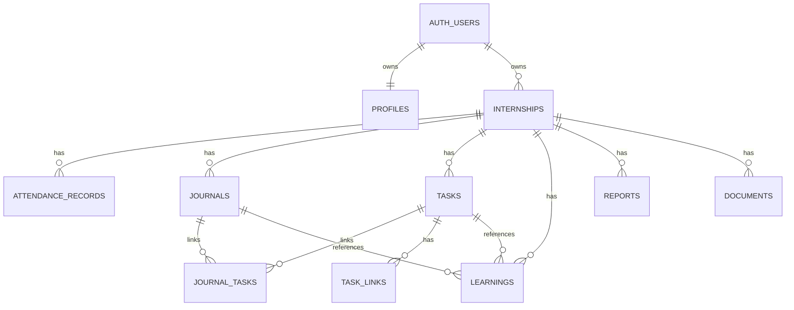

# Database Schema — Internship Companion

## 1. Konvensi

- Database: PostgreSQL.
- Primary key: UUID dengan `gen_random_uuid()`.
- Waktu absolut disimpan sebagai `timestamptz` dalam UTC.
- Tanggal kerja lokal disimpan sebagai `date`.
- Semua tabel privat memiliki `user_id`.
- Semua tabel utama memiliki `created_at` dan `updated_at`.
- Nama tabel dan kolom menggunakan `snake_case`.
- Penghapusan menggunakan hard delete pada MVP, kecuali laporan final dan dokumen yang dapat memakai `archived_at` pada fase berikutnya.

## 2. Entity Relationship Diagram



Walaupun MVP hanya memiliki satu internship aktif, entity `internships` tetap dipisahkan agar data dapat digunakan kembali untuk program berikutnya.

## 3. Enumerations

### work_mode

- `wfo`
- `wfh`
- `hybrid`
- `leave`
- `sick`
- `holiday`

### journal_status

- `draft`
- `completed`

### task_status

- `backlog`
- `todo`
- `in_progress`
- `review`
- `blocked`
- `done`

### task_priority

- `low`
- `medium`
- `high`
- `urgent`

### learning_level

- `exploring`
- `learning`
- `practicing`
- `confident`

### report_type

- `weekly`
- `monthly`
- `final`
- `custom`

### report_status

- `draft`
- `final`

### document_category

- `administration`
- `report`
- `certificate`
- `work_sample`
- `other`

### task_link_type

- `repository`
- `branch`
- `commit`
- `pull_request`
- `deployment`
- `documentation`
- `other`

## 4. Tables

### 4.1 profiles

| Column | Type | Constraint/Description |
|---|---|---|
| user_id | uuid | PK, FK → auth.users.id, cascade delete |
| full_name | text | not null |
| avatar_path | text | nullable |
| timezone | text | not null, default `Asia/Jakarta` |
| created_at | timestamptz | not null, default now() |
| updated_at | timestamptz | not null, default now() |

### 4.2 internships

| Column | Type | Constraint/Description |
|---|---|---|
| id | uuid | PK |
| user_id | uuid | FK → auth.users.id, not null |
| company_name | text | not null |
| role_title | text | not null |
| location | text | nullable |
| mentor_name | text | nullable |
| mentor_contact | text | nullable; jangan menyimpan tanpa izin |
| start_date | date | not null |
| end_date | date | not null |
| default_start_time | time | nullable |
| default_end_time | time | nullable |
| is_active | boolean | not null, default true |
| notes | text | nullable |
| created_at | timestamptz | not null, default now() |
| updated_at | timestamptz | not null, default now() |

Constraints:

- `end_date >= start_date`.
- Partial unique index agar maksimal satu internship aktif per user.

### 4.3 attendance_records

| Column | Type | Constraint/Description |
|---|---|---|
| id | uuid | PK |
| user_id | uuid | FK → auth.users.id, not null |
| internship_id | uuid | FK → internships.id, cascade delete |
| work_date | date | not null; tanggal Asia/Jakarta |
| work_mode | work_mode | not null |
| check_in_at | timestamptz | nullable |
| check_out_at | timestamptz | nullable |
| break_minutes | integer | not null, default 0 |
| location | text | nullable |
| notes | text | nullable |
| created_at | timestamptz | not null, default now() |
| updated_at | timestamptz | not null, default now() |

Constraints:

- Unique `(internship_id, work_date)`.
- `break_minutes >= 0`.
- `check_out_at IS NULL OR check_in_at IS NOT NULL`.
- `check_out_at IS NULL OR check_out_at >= check_in_at`.
- Untuk `leave`, `sick`, dan `holiday`, check-in/check-out sebaiknya null.

Derived value:

```text
worked_minutes = max(0, check_out_at - check_in_at - break_minutes)
```

Nilai dihitung ketika query atau melalui generated/view; tidak perlu disimpan pada MVP.

### 4.4 journals

| Column | Type | Constraint/Description |
|---|---|---|
| id | uuid | PK |
| user_id | uuid | FK → auth.users.id, not null |
| internship_id | uuid | FK → internships.id, cascade delete |
| journal_date | date | not null |
| title | text | nullable |
| summary | text | nullable |
| activities | text | nullable, Markdown |
| learnings | text | nullable, Markdown |
| blockers | text | nullable, Markdown |
| solutions | text | nullable, Markdown |
| next_plan | text | nullable, Markdown |
| status | journal_status | not null, default `draft` |
| completed_at | timestamptz | nullable |
| created_at | timestamptz | not null, default now() |
| updated_at | timestamptz | not null, default now() |

Constraints:

- Unique `(internship_id, journal_date)`.
- `completed_at` diisi ketika status `completed`.

### 4.5 tasks

| Column | Type | Constraint/Description |
|---|---|---|
| id | uuid | PK |
| user_id | uuid | FK → auth.users.id, not null |
| internship_id | uuid | FK → internships.id, cascade delete |
| title | text | not null |
| description | text | nullable, Markdown |
| status | task_status | not null, default `backlog` |
| priority | task_priority | not null, default `medium` |
| due_date | date | nullable |
| estimate_minutes | integer | nullable |
| actual_minutes | integer | nullable |
| sort_order | numeric | not null, default 0 |
| started_at | timestamptz | nullable |
| completed_at | timestamptz | nullable |
| created_at | timestamptz | not null, default now() |
| updated_at | timestamptz | not null, default now() |

Constraints:

- `estimate_minutes IS NULL OR estimate_minutes >= 0`.
- `actual_minutes IS NULL OR actual_minutes >= 0`.
- Index `(internship_id, status, sort_order)`.
- Index `(internship_id, due_date)`.

### 4.6 journal_tasks

| Column | Type | Constraint/Description |
|---|---|---|
| journal_id | uuid | FK → journals.id, cascade delete |
| task_id | uuid | FK → tasks.id, cascade delete |
| created_at | timestamptz | not null, default now() |

Primary key: `(journal_id, task_id)`.

Application validation memastikan journal dan task berasal dari user dan internship yang sama.

### 4.7 task_links

| Column | Type | Constraint/Description |
|---|---|---|
| id | uuid | PK |
| user_id | uuid | FK → auth.users.id, not null |
| task_id | uuid | FK → tasks.id, cascade delete |
| link_type | task_link_type | not null |
| label | text | nullable |
| url | text | not null |
| created_at | timestamptz | not null, default now() |
| updated_at | timestamptz | not null, default now() |

Constraints:

- URL harus valid dan menggunakan HTTPS pada production, kecuali environment lokal.
- Index `(task_id, link_type)`.

### 4.8 learnings

| Column | Type | Constraint/Description |
|---|---|---|
| id | uuid | PK |
| user_id | uuid | FK → auth.users.id, not null |
| internship_id | uuid | FK → internships.id, cascade delete |
| journal_id | uuid | nullable, FK → journals.id, set null |
| task_id | uuid | nullable, FK → tasks.id, set null |
| topic | text | not null |
| technology | text | nullable |
| summary | text | nullable, Markdown |
| source_url | text | nullable |
| level | learning_level | not null, default `exploring` |
| learned_on | date | not null |
| created_at | timestamptz | not null, default now() |
| updated_at | timestamptz | not null, default now() |

Index:

- `(internship_id, learned_on desc)`.
- `(internship_id, technology)`.

### 4.9 reports

| Column | Type | Constraint/Description |
|---|---|---|
| id | uuid | PK |
| user_id | uuid | FK → auth.users.id, not null |
| internship_id | uuid | FK → internships.id, cascade delete |
| report_type | report_type | not null |
| period_start | date | not null |
| period_end | date | not null |
| title | text | not null |
| content_markdown | text | not null |
| source_snapshot | jsonb | not null, default `{}` |
| statistics | jsonb | not null, default `{}` |
| status | report_status | not null, default `draft` |
| finalized_at | timestamptz | nullable |
| created_at | timestamptz | not null, default now() |
| updated_at | timestamptz | not null, default now() |

Constraints:

- `period_end >= period_start`.
- Unique final report dapat diterapkan melalui partial unique index pada `(internship_id, report_type, period_start, period_end)` saat `status = 'final'`.

Contoh `statistics`:

```json
{
  "workingDays": 5,
  "workedMinutes": 2280,
  "completedTasks": 7,
  "blockedTasks": 1,
  "completedJournals": 5
}
```

### 4.10 documents

| Column | Type | Constraint/Description |
|---|---|---|
| id | uuid | PK |
| user_id | uuid | FK → auth.users.id, not null |
| internship_id | uuid | FK → internships.id, cascade delete |
| category | document_category | not null |
| name | text | not null |
| description | text | nullable |
| storage_path | text | nullable |
| external_url | text | nullable |
| mime_type | text | nullable |
| size_bytes | bigint | nullable |
| document_date | date | nullable |
| created_at | timestamptz | not null, default now() |
| updated_at | timestamptz | not null, default now() |

Constraints:

- Tepat satu dari `storage_path` atau `external_url` harus terisi.
- `size_bytes IS NULL OR size_bytes >= 0`.

## 5. Recommended Views

### attendance_with_duration

Menghasilkan `worked_minutes` tanpa menyimpan nilai turunan.

### dashboard_daily_summary

Menggabungkan status attendance, jumlah tugas per status, deadline terdekat, dan status jurnal untuk tanggal tertentu.

Untuk MVP, view dashboard dapat digantikan dengan query terpisah jika lebih sederhana. Optimasi dilakukan setelah profiling.

## 6. Row Level Security

Aktifkan RLS pada seluruh tabel publik. Pola kebijakan dasar:

```sql
create policy "users_manage_own_rows"
on public.tasks
for all
to authenticated
using (user_id = auth.uid())
with check (user_id = auth.uid());
```

Terapkan pola tersebut pada `profiles`, `internships`, `attendance_records`, `journals`, `tasks`, `task_links`, `learnings`, `reports`, dan `documents`.

Untuk `journal_tasks`, authorization harus divalidasi melalui parent journal dan task. Pilihan paling sederhana adalah menambahkan `user_id` pada junction table atau membuat policy `exists` terhadap kedua parent. Untuk konsistensi dan policy yang lebih sederhana, disarankan menambahkan `user_id` jika implementasi RLS junction menjadi sulit.

## 7. Integrity Rules

Database constraint harus mencakup aturan yang dapat dinyatakan di PostgreSQL. Application service tetap memvalidasi:

- Parent entity dimiliki oleh user yang sama.
- Parent entity berasal dari internship yang sama.
- Transisi status tugas.
- Batas ukuran dan tipe dokumen.
- Laporan final tidak diedit tanpa kembali menjadi draft.
- Tanggal jurnal/kehadiran berada dalam rentang internship, kecuali pengguna mengonfirmasi pengecualian.

## 8. Updated At Trigger

Gunakan satu trigger function untuk memperbarui `updated_at` pada setiap update.

```sql
create or replace function public.set_updated_at()
returns trigger
language plpgsql
as $$
begin
  new.updated_at = now();
  return new;
end;
$$;
```

## 9. Seed Data Development

Seed minimum:

- Satu user development.
- Satu internship PT Tiga Serangkai sebagai Software Developer.
- Attendance tujuh hari.
- Enam jurnal dalam status campuran.
- Sepuluh tugas yang tersebar di seluruh status.
- Lima learning records.
- Satu draft laporan mingguan.

Hindari menggunakan informasi internal atau data produksi sebagai seed.

## 10. Migration Order

1. Extensions dan enums.
2. `profiles` dan `internships`.
3. `attendance_records`, `journals`, dan `tasks`.
4. `journal_tasks` dan `task_links`.
5. `learnings`, `reports`, dan `documents`.
6. Index, trigger, dan constraints tambahan.
7. RLS policies.
8. Views dan seed development.
